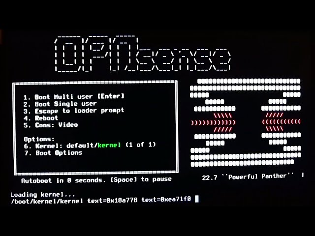

# 🛡️ Projeto "Soberania Digital": Firewall de Próxima Geração com OPNsense & Suricata

## 📖 Por que este projeto existe?

Cansado de depender de roteadores "caixa-preta" de operadoras que priorizam o baixo custo em vez da sua privacidade? Eu também. O objetivo aqui foi retomar o controle total do que entra e sai da minha rede.

Este projeto documenta a implementação do **OPNsense**, um fork do pfSense que leva a sério a interface do usuário e a segurança endurecida (HardenedBSD). Aqui, transformamos hardware comum em um **Next-Generation Firewall (NGFW)**, focado em visibilidade total e bloqueio implacável de ameaças.

### 🏗️ A "Fortaleza" (Hardware & Topologia)

* **O Cérebro:** Hardware dedicado (ou VM no Proxmox) com foco em eficiência e estabilidade.
* **O Setup:** Modem ISP (Modo Bridge - o "Clandestino") ➡️ **OPNsense (O Arquiteto)** ➡️ Switch Gerenciável ➡️ Home Lab / Wi-Fi.
* **O Diferencial:** No OPNsense, a separação de privilégios e o uso de ferramentas modernas como o **Unbound DNS** garantem que a rede não seja apenas rápida, mas silenciosa para quem olha de fora.

---

## 🛠️ Passo 1: Definindo os Limites (Interfaces)

O primeiro passo é mapear o território. No console do OPNsense, definimos quem é a porta de entrada para o caos e quem é o santuário.

* **O que fazer:** Atribuição de `WAN` (Internet) e `LAN` (Rede Local).
* **Por que:** Sem uma demarcação clara, o firewall é apenas um computador caro. Aqui, garantimos que nada passe da WAN para a LAN sem uma regra explícita de "sim, eu permito".
* **Dica de mestre:** No OPNsense, aproveite para já configurar as VLANs se você pretende separar o tráfego de IoT (lâmpadas, câmeras) da sua rede principal de trabalho.

  

---

## 🌐 Passo 2: O Despertar (Configuração Inicial)

Nada de configurações padrão. Aqui a gente aperta os parafusos desde o minuto zero.

### Tela: General Setup & DNS

* **Configuração:** DNS over TLS via Cloudflare ou Quad9.
* **O que isso faz:** Criptografa suas requisições de DNS. Nem mesmo seu provedor (ISP) conseguirá bisbilhotar quais sites você está tentando acessar. Privacidade é um direito, não um privilégio.

### Tela: WAN Hardening

* **Configuração:** Ativação imediata de **"Block Private Networks"** e **"Block Bogon Networks"**.
* **O efeito:** Isso cria um "buraco negro" para tráfego inválido. Se o pacote não deveria estar na internet pública, ele morre na casca antes de chegar perto dos seus dispositivos.

---

## 🔒 Passo 3: Fortificando o Acesso (Hardening)

Um firewall que pode ser acessado por qualquer um não é um firewall, é um alvo.

* **Ação:** Alteração da porta da WebGUI, desativação do login via HTTP e configuração de **MFA (Autenticação de Dois Fatores)** para o dashboard.
* **Por que:** Se alguém conseguir o seu login, ainda precisará do token no seu celular para entrar. Segurança em camadas!
* **Anti-Brute Force:** O OPNsense já vem com proteções nativas para banir IPs que tentam errar a senha repetidamente.

---

## 🕵️ Passo 4: Suricata - A Inteligência de Borda (IDS/IPS)

Se o firewall é o muro, o **Suricata** é o guarda que inspeciona cada mochila que entra. No OPNsense, ele é integrado de forma magnífica.

1.  **Monitoramento:** Ativação do modo de detecção de intrusão nas interfaces críticas.
2.  **Regras de Elite:** Utilização das listas **ET Open (Emerging Threats)** para detectar malwares conhecidos e tentativas de exploit em tempo real.
3.  **Inspeção de Pacotes:** Diferente de um firewall comum que olha apenas "quem e para onde", o Suricata olha o **conteúdo**. Se um pacote carrega uma assinatura de ataque, o OPNsense dropa a conexão na hora.
4.  **Hardware Offloading:** Ajustado para garantir que a inspeção não gere gargalos na velocidade da fibra.

> *(Imagem: Log do Suricata detectando um port scan vindo de um IP estrangeiro)*

---

## ✅ Validação e Relatórios (A Hora da Verdade)

Para um Analista de SOC, dado sem visualização é ruído. O OPNsense brilha aqui:

1.  **NetFlow:** Ativei os gráficos de fluxo para ver quem são os "vilões" de largura de banda na rede.
2.  **Health Check:** Monitoramento de CPU e RAM para garantir que o Suricata não está sobrecarregando o sistema.
3.  **Teste de Penetração:** Executei um scan externo (Nmap) e o resultado foi o esperado: **Todas as portas filtradas/stealth**. A rede simplesmente não responde a "curiosos".

---

## 🚀 Conclusão

Migrar para o OPNsense foi a melhor decisão para o meu laboratório de segurança. Saí de uma rede "caixa de sapato" para um ambiente onde cada pacote tem um histórico e cada tentativa de invasão vira um log de aprendizado. A Defesa em Profundidade começa na borda!

---

**Gostou dessa abordagem Blue Team?** Vamos trocar conhecimentos sobre defesa e monitoramento no [LinkedIn](https://www.linkedin.com/in/tecdarwin/)!
