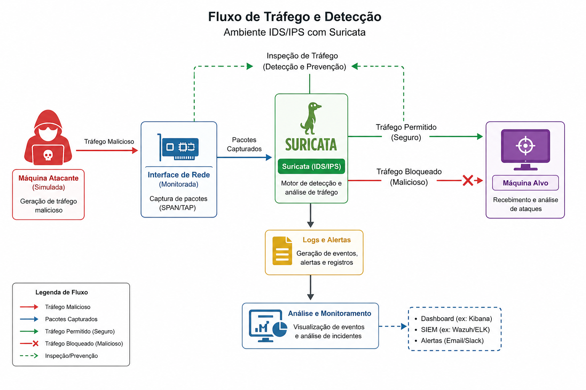
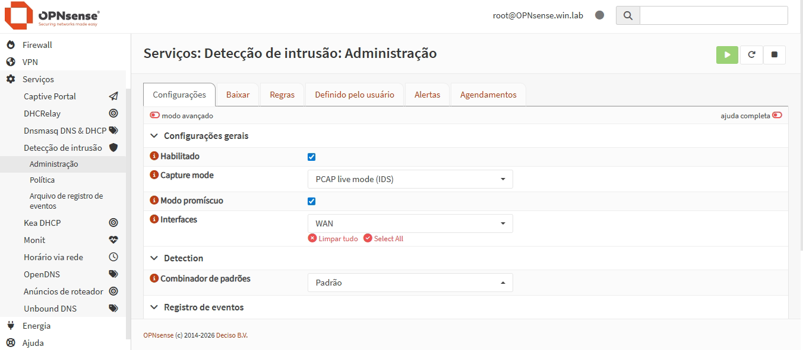
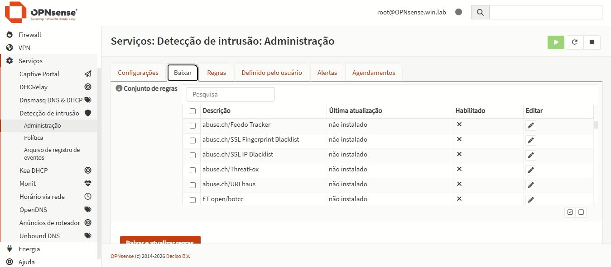
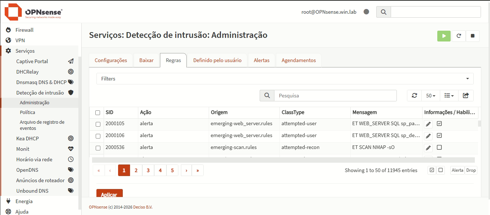

# 🛡️ IDS/IPS Lab – Suricata

Este projeto documenta a implementação de um laboratório de **IDS/IPS utilizando Suricata**, com foco em **detecção de ameaças, inspeção de tráfego e validação prática de regras de segurança**.

O objetivo foi simular um ambiente realista de rede, permitindo análise profunda de pacotes (**DPI – Deep Packet Inspection**) e avaliação da eficácia de mecanismos de detecção baseados em assinaturas.

---

## 🎯 Objetivos do Projeto

* Implementar um IDS/IPS funcional com Suricata
* Monitorar tráfego de rede em tempo real
* Criar e ajustar regras de detecção (signatures)
* Simular ataques para validar o sistema
* Reduzir falsos positivos através de tuning

---

## 🧱 Arquitetura do Lab

O ambiente foi estruturado com os seguintes componentes:

* **Suricata (IDS/IPS)** → Motor de detecção e análise de tráfego
* **Interface de rede monitorada** → Captura de pacotes
* **Máquina atacante (simulada)** → Geração de tráfego malicioso
* **Máquina alvo** → Recebimento e análise de ataques

<p align="center">
  
</p>

---

## 🔍 Fase 1 – Implementação do Suricata

### ⚙️ Instalação e Configuração

O Suricata foi configurado para operar em modo:

* IDS (detecção passiva)
* IPS (bloqueio ativo)

➡️ **Objetivo:** Obter visibilidade e capacidade de resposta

---

### 📡 Captura de Tráfego

O monitoramento foi realizado em uma interface de rede dedicada:

```bash id="suricata01"
suricata -i eth0
```

➡️ **Insight:** A escolha correta da interface é essencial para visibilidade completa do tráfego

<p align="center">
  
</p>

---

## 🔬 Fase 2 – Deep Packet Inspection (DPI)

O Suricata foi configurado para realizar inspeção profunda de pacotes, permitindo:

* Análise de payloads
* Identificação de padrões maliciosos
* Detecção de exploits conhecidos

➡️ **Diferencial:** DPI permite detectar ameaças que não seriam visíveis apenas por análise superficial

<p align="center">
  
</p>

---

## 🧾 Fase 3 – Regras de Detecção (Signatures)

### 🛠️ Configuração de Regras

Foram utilizadas:

* Regras padrão (ET Open / Emerging Threats)
* Regras customizadas

Exemplo de regra:

```id="rule01"
alert tcp any any -> any 80 (msg:"HTTP suspicious traffic"; content:"malicious"; sid:1000001; rev:1;)
```

➡️ **Objetivo:** Detectar padrões específicos de tráfego suspeito

<p align="center">
  
</p>

---

## 🔥 Fase 4 – Simulação de Ataques

Para validar o ambiente, foram realizadas simulações como:

* Tentativas de acesso indevido
* Exploração de serviços
* Tráfego malicioso controlado

[INSERIR IMAGEM: simulação de ataque gerando alertas]

➡️ **Resultado:** Geração de alertas em tempo real pelo Suricata

---

## 📊 Fase 5 – Monitoramento em Tempo Real

Logs e alertas foram analisados continuamente:

* Identificação de eventos relevantes
* Correlação manual de atividades
* Validação de detecções

<p align="center">
  
</p>
---

## 🎯 Fase 6 – Tuning e Redução de Falsos Positivos

### ⚠️ Problema

Inicialmente, foram observados:

* Alto volume de alertas
* Falsos positivos

---

### 🔧 Ajustes realizados

* Refinamento de regras
* Ajuste de thresholds
* Desativação de regras irrelevantes
* Customização baseada no ambiente

➡️ **Resultado:** Sistema mais eficiente e confiável

---

## 📈 Resultados Obtidos

* Detecção eficaz de tráfego malicioso
* Redução significativa de falsos positivos
* Melhor compreensão do comportamento de rede
* Implementação prática de IDS/IPS

---

## 🧠 Lições Aprendidas

* IDS sem tuning gera ruído excessivo
* Assinaturas precisam ser adaptadas ao ambiente
* DPI é essencial para detecção avançada
* Simulações são fundamentais para validação
* Monitoramento contínuo melhora a resposta a incidentes

---

## 🛡️ Conceitos Aplicados

* IDS (Intrusion Detection System)
* IPS (Intrusion Prevention System)
* DPI (Deep Packet Inspection)
* Signature-Based Detection
* Network Security Monitoring
* Threat Detection

---

## 📊 Diferenciais Técnicos Demonstrados

Este projeto evidencia:

* Implementação prática de IDS/IPS
* Criação e ajuste de regras de detecção
* Análise de tráfego de rede
* Validação de segurança via simulação de ataques
* Capacidade de tuning para ambientes reais

---

## 📌 Considerações Finais

Este laboratório reforça a importância de sistemas de detecção bem configurados e ajustados, demonstrando que:

✔ Detectar é importante, mas **detectar com precisão é essencial**
✔ Tuning é uma etapa crítica em qualquer solução de segurança
✔ Visibilidade de rede é um dos pilares da defesa cibernética


---

## 📎 Observação

As imagens serão adicionadas com o passar do tempo.

---
